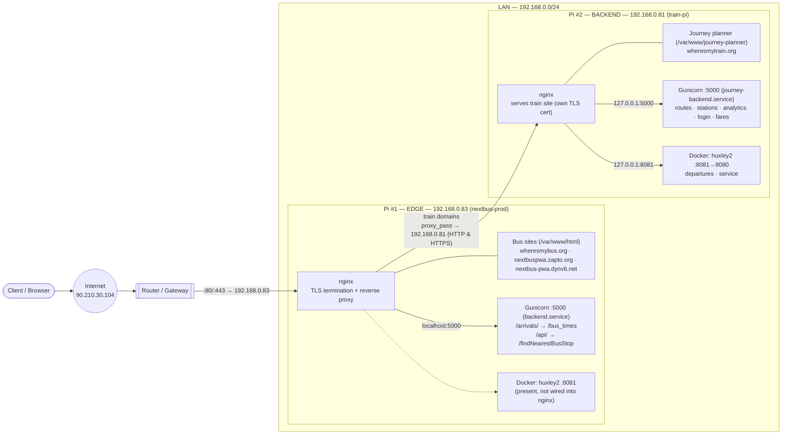
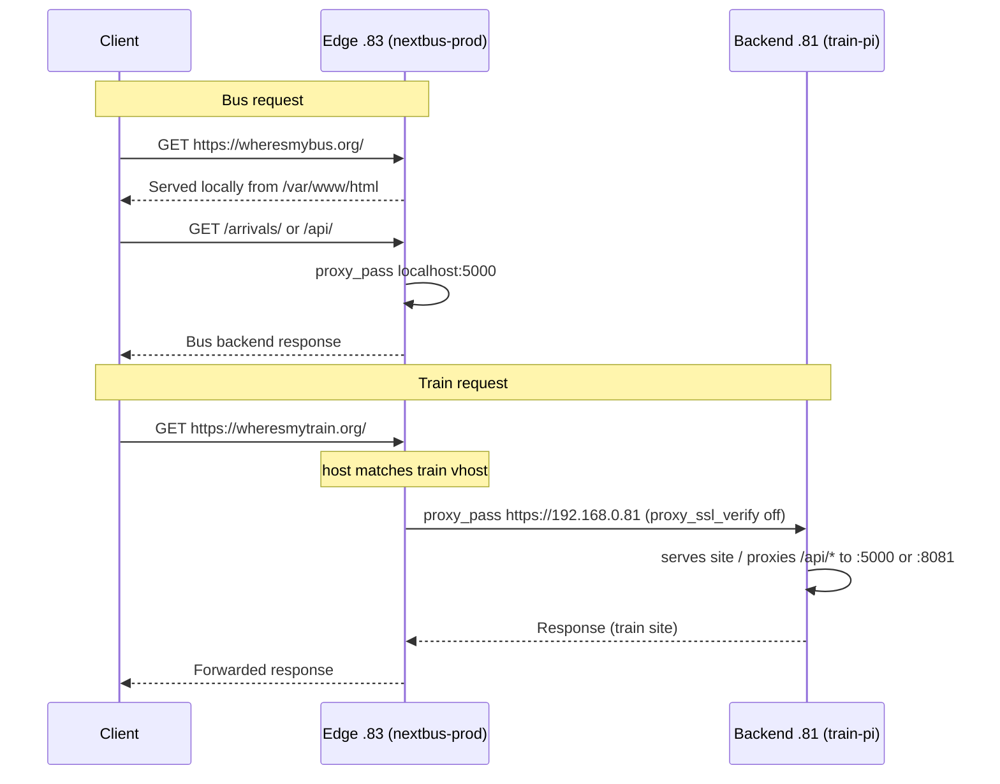

# Raspberry Pi Network Architecture

Two Raspberry Pis running **nginx**. One is the internet-facing **edge / reverse-proxy** that hosts the *bus* websites and forwards the *train* domains to the second Pi, which is the **backend** hosting the *train* website.

> Documented from the live `nginx -T` output of both Pis on **2026-08-25**.

---

## 1. Roles at a glance

| Device | IP | Hostname | Role | Hosts / serves |
| ------ | -- | -------- | ---- | -------------- |
| Pi #1 (edge) | `192.168.0.83` | `nextbus-prod` | **Edge / reverse proxy** (internet-facing) | Bus sites locally **+** proxies train domains to `.81` |
| Pi #2 (backend) | `192.168.0.81` | `train-pi` | **Backend** (reached only via the edge) | Train site (`wheresmytrain.org`, `trainzz.co.uk`) |

**Public entry point:** `90.210.30.104` (the edge's WAN IP) → router forwards `80/443` to `192.168.0.83`.

**Domains**

- Served **locally** on the edge `.83`: `wheresmybus.org`, `nextbus-pwa.dynv6.net`, `nextbuspwa.zapto.org`
- **Proxied** by the edge `.83` to the backend `.81`: `wheresmytrain.org`, `trainzz.co.uk`, `www.trainzz.co.uk`, and IP access via `90.210.30.104`

---

## 2. High-level topology



---

## 3. Request flow



**In words:**
1. All public traffic arrives at the **edge `.83`** (via `90.210.30.104` → router → `192.168.0.83`).
2. nginx on the edge picks the virtual host by **domain name**:
   - **Bus domains** (`wheresmybus.org`, `nextbuspwa.zapto.org`, `nextbus-pwa.dynv6.net`) are served **locally** from `/var/www/html`, with `/arrivals/` and `/api/` reverse-proxied to a local app on **`localhost:5000`**.
   - **Train domains** (`wheresmytrain.org`, `trainzz.co.uk`, `www.trainzz.co.uk`) are **forwarded** to the **backend `.81`** via `proxy_pass`.
3. The edge terminates TLS for every domain using its own Let's Encrypt certificates, then re-proxies the train traffic to `.81` over HTTPS with `proxy_ssl_verify off` (the backend holds its own cert for `wheresmytrain.org`).
4. The **backend `.81`** serves the journey-planner site from `/var/www/journey-planner` and reverse-proxies its own `/api/*` paths to two local apps:
   - **`:5000`** → `get_routes`, `nearby_stations`, `analytics/`, `login`, `fares/`
   - **`:8081`** → `departures/`, `service/`
5. The backend trusts the edge for the real client IP via `set_real_ip_from 192.168.0.83;` + `real_ip_header X-Real-IP;`.

---

## 4. Edge Pi `.83` — key nginx config (as deployed)

Local bus vhost (repeated for each bus domain), from `/etc/nginx/sites-enabled/default`:

```nginx
server {
    root /var/www/html;
    index index.html index.htm index.nginx-debian.html;
    server_name wheresmybus.org;              # also nextbuspwa.zapto.org, nextbus-pwa.dynv6.net, _

    location / { try_files $uri $uri/ =404; }

    location /arrivals/ {
        proxy_pass http://localhost:5000/bus_times;
        proxy_http_version 1.1;
        proxy_set_header Upgrade $http_upgrade;
        proxy_set_header Connection 'upgrade';
        proxy_set_header Host $host;
        proxy_cache_bypass $http_upgrade;
        proxy_set_header X-Forwarded-For $proxy_add_x_forwarded_for;
        proxy_set_header X-Forwarded-Proto $scheme;
    }
    location /api/ {
        proxy_pass http://localhost:5000/findNearestBusStop;
        # (same proxy headers as above)
    }

    listen 443 ssl;                            # managed by Certbot
    ssl_certificate     /etc/letsencrypt/live/wheresmybus.org/fullchain.pem;
    ssl_certificate_key /etc/letsencrypt/live/wheresmybus.org/privkey.pem;
}
```

Train forwarding vhosts (HTTP redirect → HTTPS, then proxy to backend):

```nginx
# HTTPS → backend train-pi
server {
    listen 443 ssl;
    listen [::]:443 ssl;
    server_name wheresmytrain.org;             # also trainzz.co.uk / www.trainzz.co.uk in a sibling block
    ssl_certificate     /etc/letsencrypt/live/wheresmytrain.org/fullchain.pem;
    ssl_certificate_key /etc/letsencrypt/live/wheresmytrain.org/privkey.pem;

    location / {
        proxy_pass https://192.168.0.81;
        proxy_http_version 1.1;
        proxy_set_header Host $host;
        proxy_set_header X-Real-IP $remote_addr;
        proxy_set_header X-Forwarded-For $proxy_add_x_forwarded_for;
        proxy_set_header X-Forwarded-Proto $scheme;
        proxy_ssl_verify off;
    }
}

# Raw public-IP access → backend over HTTP
server {
    listen 80;
    server_name 90.210.30.104;
    location / { proxy_pass http://192.168.0.81; }
}
```

---

## 5. Backend Pi `.81` — key nginx config (as deployed)

From `/etc/nginx/sites-enabled/default`:

```nginx
# HTTP → HTTPS redirect + ACME challenge
server {
    listen 80 default_server;
    server_name wheresmytrain.org;
    location /.well-known/acme-challenge/ { root /var/www/journey-planner; }
    location / { return 301 https://$host$request_uri; }
}

# HTTPS site
server {
    listen 443 ssl default_server;

    set_real_ip_from 192.168.0.83;             # trust the edge for real client IP
    real_ip_header   X-Real-IP;

    ssl_certificate     /etc/letsencrypt/live/wheresmytrain.org/fullchain.pem;
    ssl_certificate_key /etc/letsencrypt/live/wheresmytrain.org/privkey.pem;

    root /var/www/journey-planner;
    index index.html;
    server_name wheresmytrain.org;

    location / { try_files $uri $uri/ /index.html; }

    # App backends
    location /api/get_routes      { proxy_pass http://127.0.0.1:5000/get_routes; }
    location /api/nearby_stations { proxy_pass http://127.0.0.1:5000/nearby_stations; }
    location /api/analytics/      { proxy_pass http://127.0.0.1:5000/analytics/; }
    location /api/login           { proxy_pass http://127.0.0.1:5000/login; }
    location /api/fares/          { proxy_pass http://127.0.0.1:5000/fares/; }
    location /api/departures/     { proxy_pass http://127.0.0.1:8081/departures/; }
    location /api/service/        { proxy_pass http://127.0.0.1:8081/service/; }
    # (each /api block also sets Host, X-Real-IP, X-Forwarded-For)
}
```

---

## 6. Application / service layer (from `ss -tlnp` + `docker ps`)

### Backend `.81` (train-pi)

| Port | Process | Unit / container | Serves |
| ---- | ------- | ---------------- | ------ |
| `127.0.0.1:5000` | **Gunicorn** (Python/Flask) | `journey-backend.service` — "Journey Backend Flask App" | `get_routes`, `nearby_stations`, `analytics/`, `login`, `fares/` |
| `0.0.0.0:8081` → container `:8080` | **Docker** `huxley2-huxley2-1` (image `huxley2-huxley2`) | Docker (`docker.service`) | `departures/`, `service/` (live train boards) |
| `:80` / `:443` | **nginx** | `nginx.service` | Train site + TLS |

### Edge `.83` (nextbus-prod)

| Port | Process | Unit / container | Serves |
| ---- | ------- | ---------------- | ------ |
| `0.0.0.0:5000` | **Gunicorn** (Python/Flask) | `backend.service` — "Gunicorn instance to serve the backend" | `/arrivals/` → `bus_times`, `/api/` → `findNearestBusStop` |
| `0.0.0.0:8081` → container `:80` | **Docker** `huxley2_huxley2_1` (image `huxley2_huxley2`) | Docker (`docker.service`) | Running, but **not referenced** by the edge's nginx config (likely legacy / direct-access) |
| `:80` / `:443` | **nginx** | `nginx.service` | Bus sites + TLS + train proxy |

**What is Huxley2?** An open-source JSON/REST proxy in front of National Rail's OpenLDBWS SOAP API, used to fetch live UK train departure/arrival boards — which is why the train Pi's `/api/departures/` and `/api/service/` point at it.

> Both Pis also run desktop/support services not part of the web stack: **wayvnc** (VNC on `:5900`), **CUPS** (printing on `:631`), and a **VS Code Remote/tunnel** server (`code-...` on a random localhost port). These aren't exposed to the internet by nginx.

---

## 7. Observations & recommendations

- **TLS is terminated twice for train traffic** (edge terminates, then re-encrypts to `.81` with `proxy_ssl_verify off`). This works, but `proxy_ssl_verify off` means the edge doesn't validate the backend cert. On a trusted LAN this is acceptable; alternatively proxy to the backend over plain HTTP to avoid the double TLS hop.
- **`server_tokens off`** is set on the edge (good — hides the nginx version). Consider the same on the backend `.81`.
- **Lock down the backend:** `.81` is directly reachable on the LAN (ports 80/443 open). Since it should only be served via the edge, consider restricting its nginx/firewall to accept connections only from `192.168.0.83`.
- **Docker present:** both Pis run a **Huxley2** container published on `:8081`. On the backend `.81` it is used (`/api/departures/`, `/api/service/`); on the edge `.83` the container is running but **not referenced by nginx** — confirm whether it's still needed or leftover.
- **`:8081` is bound to `0.0.0.0` on both Pis** (docker-proxy), so Huxley2 is reachable from the whole LAN and potentially the internet if the router forwards it. If only nginx should reach it, publish it on `127.0.0.1:8081` instead (`-p 127.0.0.1:8081:80`).
- **Duplicate vhost blocks on the edge** (identical bus config repeated per domain) could be consolidated with a single `server_name a b c;` list to reduce drift.
- **Static IPs:** ensure `.81` and `.83` are DHCP-reserved / static so the `proxy_pass` targets don't break.
- **Certificates:** `wheresmytrain.org` has certs on **both** Pis; make sure both renew (certbot) or the double-TLS hop can fail silently.
```
